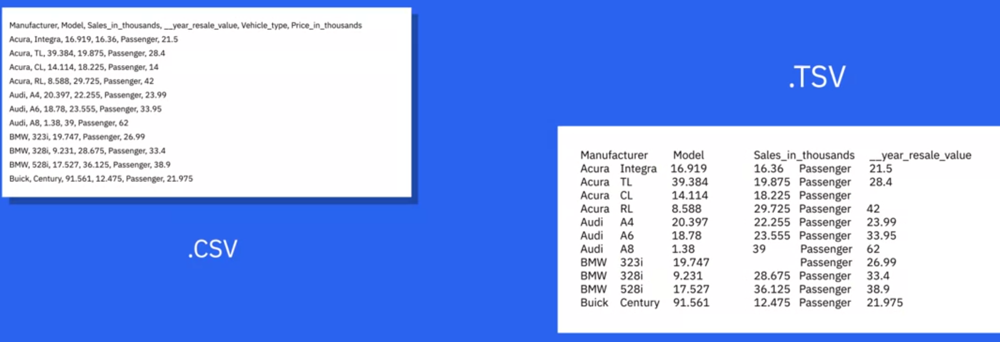
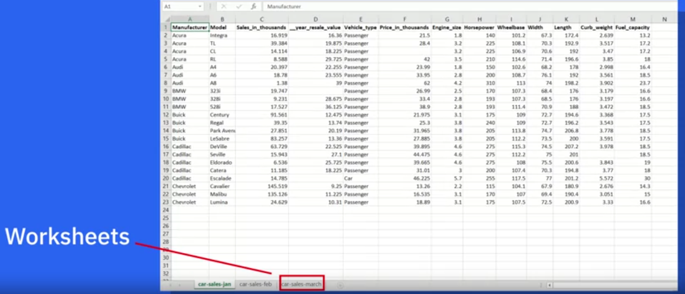

# Defining Data Science

**Data Science** is a process of using data to understand different things. It's used when you have a model or hypothesis and you try to validate it with your data. It's also the process of uncovering the insights and trends that are hiding behind data, so you make strategic choices for a company

It's the study of data to understand the world

Data Scientists translate data into stories to generate insights. They also investigate and find explanations for many problems

It has a significant Data Analysis component. Now we have tons of data available from varied sources and computer power to make useful analysis and generate new knowledge

Data Science can help companies:

* understand their environments

* analyze existing issues

* reveal hidden opportunities

Many companies will use data science to focus on a specific problem, so it's really necessary to **clarify the question that the organization wants answered**

Data scientists must ask questions to **clarify the business need**

Other questions that must be answered is: **what data do we need to solve the problem?**, **where will that data come from?**

Using multiple models to explore the data reveals patterns and outliers. Sometimes, this will confirm what the organization suspects, but sometime it'll be brand new knowledge

When the data has revealed its insights, the role of the data scientist becomes that of a storyteller, communicating the results to the project stakeholders. They can also use powerful visialization tools to help stakeholders understand the nature of the results and the recommended action to take

### Data Science: the sexiest job in the 21st century

The global search for skilled data scientist is not merely a search for statisticians or computer scientists. In fact, the firms are searching for well-rounded individuals who possess the subject matter expertise, some experience in software programming and analytics, and exceptional communication skills

### Advice for new Data Scientists

* Be curious
    * Because if you weren't, you would know what to do with the data
    * Helps to come up with good questios

* Be extremely argumentative
    * Because if you can argument and if you can plead a case, at least you can start somewhere and then you learn from data and, from that, modify your assumptions and hypotheses
    * Helps to explain your findings

* Be judgmental
    * Helps to start in the right direction

* Comfort and flexibility with analytics platforms: some software, some computing platform

* Ability to tell a story: once you've had your analytics, you should be able to tell a great story from it

* Figure out where your expertise lies (health industry, retail industry...)

The process of gleaning insights from data includes:

* clarifying the problem

* data collection

* analysis

* pattern recognition

* storytelling

* visualization

### Glossary

* **Algorithms**: A set of step-by-step instructions to solve a problem

* **Model**: A representation of the relations and patterns found in data to make predictions or analyze complex systems

* **Outliers**: When a data point or points occur significantly outside of most of the other data in a data set (potentially indicating anomalies, errors or unique phenomena)

* **Quantitative Analysis**: A systematic approach using mathematical and statistical analysis is used to interpret numerical data

* **Structural Data**: Data is organized and formatted into a predictable schema, usually tables with rows and columns

* **Unstructural Data**: Unorganized data that lacks a predefined data model or organization makes it harder to analyze using traditional methods

# What do Data Scientists do?

## A Day in the Life of a Data Scientist

There are some projects that data scientists may work on:

* Recommendation systems

* Models that predict something

* Analyzing data to know why there are so many complaints on certain days

## Understanding Different Types of File Formats

It's important to understand the underlying structure of file formats along with their benefits and limitations

1. **Delimited Text File Formats (.CSV)**
    * Store data as text
    * Each value is separated by a delimiter
    * Delimiter is a sequence of one or more characters for specifying the boundary between independent entities or values (Comma, Tab, Colon, Vertical Bar, Space)
    * Comma-separated values (.CSV) and Tab-separated values (.TSV) are the most commonly used file type in this format
    * Each row in a .CSV file has a set of values separated by commas and represent a record
    * The first row works as a column header

2. **Microsoft Excel Open .XML Spreadsheet (.XLSX)**
    * It falls under the spreadsheet file format
    * It's a XML-based file format
    * There can be multiple worksheets
    * Each worksheet has a set of rows and columns
    * Each cell contains data

3. **Extensible Markup Languafe (.XML)**
    * It's a markup language with set rules for encoding data
    * Similar to .HTML in some aspects (it does not use predefined tags)
    * It's platform independent
    * It's programming language independent

4. **Portable Document Format (.PDF)**
    * It presents documents independent of application software, hardware or operating systems

5. **Javascript Object Notation (.JSON)**
    * Text-based open standard designed for presenting structured data
    * Language-independent data format
    * One of the best tools for sharing data

Using complicated machine learning algorithms does not always guarantee achieving a better performance. Occasionally, a simple algorithm such as k-nearest neighbor can yield a satisfactory performance comparable to the one achieved using a complicated algorithm. It all depends on the data and on the application

A Data Scientist is someone who finds solutions to problems by analyzing data using appropriate tools and then tells stories to communicate his/her findings to the relevant stakeholders. He/she has to have a curious mind, fluency in analytics and the ability to communicate the findings

### Glossary

* **Data Visualization**: A visual way of representing data in a readily understandable way makes it easier to see trends in the data

* **Hadoop**: An open-source framework designed to store and process large datasets across clusters of computers

* **Nearest Neighbor**: A machine learning algorithm that predicts a target variable based on its similarity to other values in the dataset

* **Neural Network**: A computational model used in deep learning that mimics the structure and functioning of the human brain's neural pathways

* **Pandas**: An open-source Python library that provides tools for working with structured data. It's often used for data manipulation anjd analysis

* **R**: An open-source programming language used for statistical computing, data analysis and data visualization