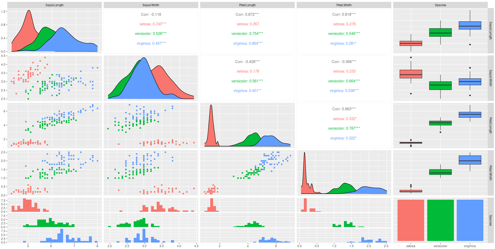

# RStudio IDE

## Introduction to R

R is a statistical programming language

It's used for **data processing**, **manipulation**, **statistical inference**, **data analysis** and **machine learning**

R supports importing data from different sources: flat files, databases, web, statistical software

### R Capabilities

* It's easy to use compared to other data science tools

* Great tool for visualization

## What is RStudio?

* It's an IDE

### Popular R Libraries for Data Science

* **dplyr**: Data Manipulation

* **stringr**: String Manipulation

* **ggplot**, **Plotly**: Data Visualization

*  **Leaflet**: Creat interactive plots

* **Lattice**: Implement complex, multi-variable data sets

* **caret**: Machine Learning

## Using Data Visualization in R

```
# Define the cars vector with 5 values
cars c (1, 4, 6, 5, 10)
# Graph the cars vector with all defaults
plot(cars)
```

You can add a line between the points:
```
cars c(1, 4, 6, 5, 10)
# Add a line between the points
plot(cars, type="o")
# Create a title
title(main="Cars vs Index")
```

### Using ggplot

ggplot adds layers of functios and arguments

```
#load ggplot package
library(ggplot2)

#create a scatterplot of displacement (disp) and miles per gallon (mpg) - attributes of mtcars dataset
ggplot(aes(x=disp,y=mpg,),data=mtcars)+geom_point()
```

You can add titles to plot and change axis name

```
ggplot(mtcars, aes(x=mpg, y=wt)) + geom_point() + ggtitle("Miles per gallon vs weight") + labs(y="weight", x="Miles per galoon")
```

### Loading datasets

```
library(datasets)
data(iris)
View(iris)

# View first 5 rows
head(iris, 5)
```

### Getting information about a dataset variables
```
# This will print the information on the Help tab
?datasetName
```

### Print the unique iris species

```
# unique(dataset$attribute)
unique(iris$Species)
```

### Creating Boxplots

Use the following to create a boxplot of the the distribution of mpg for the individual Engine types *vs* Engine (0 = V-shaped, 1 = straight)
To do this you have to make *vs* a string or factor.

```
#make vs a factor
mtcars$vs <- as.factor(mtcars$vs)

#create boxplot of the distribution for v-shaped and straight Engine
ggplot(aes(x=vs, y=mpg), data = mtcars) + geom_boxplot()
```

We can add color to the boxplots

```
ggplot(aes(x=vs, y=mpg, fill = vs), data = mtcars) + 
geom_boxplot(alpha=0.3) +
theme(legend.position="none")
```

### Creating a Histogram

Create the histogram of weight *wt*

```
ggplot(aes(x=wt),data=mtcars) + geom_histogram(binwidth=0.5)
```

### Creating plenty of plots in a single line using GGally

```
library(GGally)
ggpairs(iris, mapping=ggplot2::aes(colour = Species))
```



This gives you a lot of information for a single line of code. First, you can see the **data distributions** per column and species on the diagonal. Then you see all the pair-wise **scatter plots** on the tiles left to the diagonal, again segregated by color. It is, for example, obvious that a line can be drawn to separate setosa against versicolor and virginica

You can also see the **correlation between individual columns** in the tiles on the right to the diagonal, which confirms that setose is more different, hence easier to distinguish, than versicolor and virginica. A correlation value close to one signifies high similarity, whereas a value closer to zero signifies less similarity. The remaining plots on the right are called box-plots, and the ones at the bottom are called histograms, but you will learn about this in a more advanced course in this series