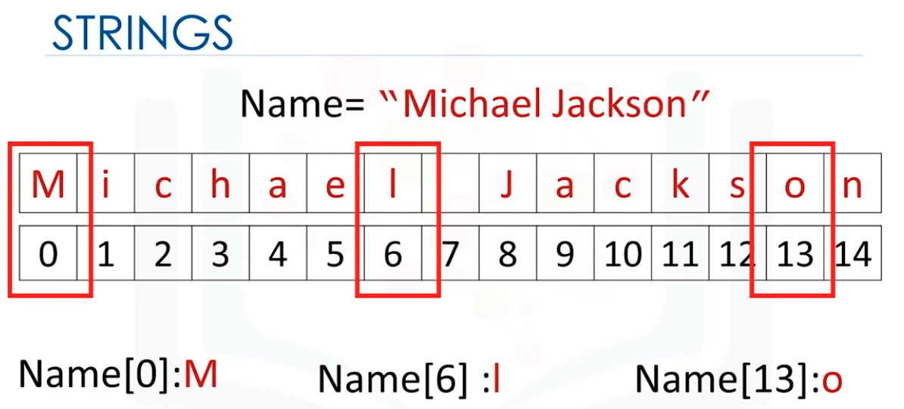
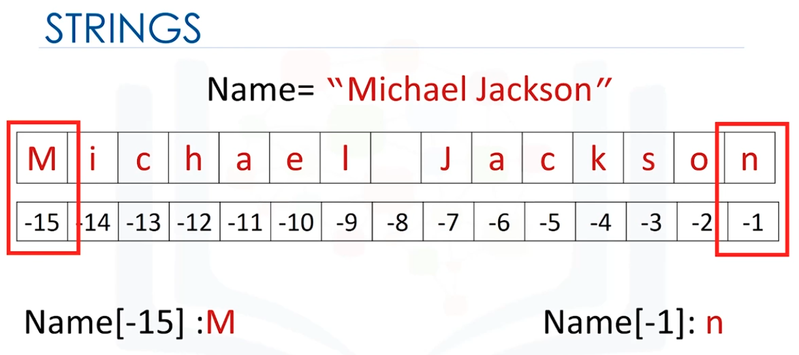
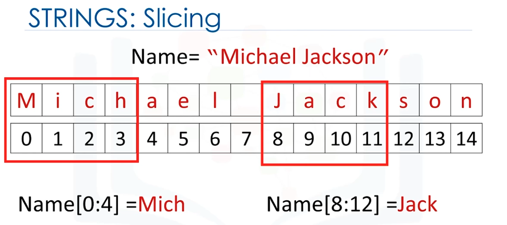
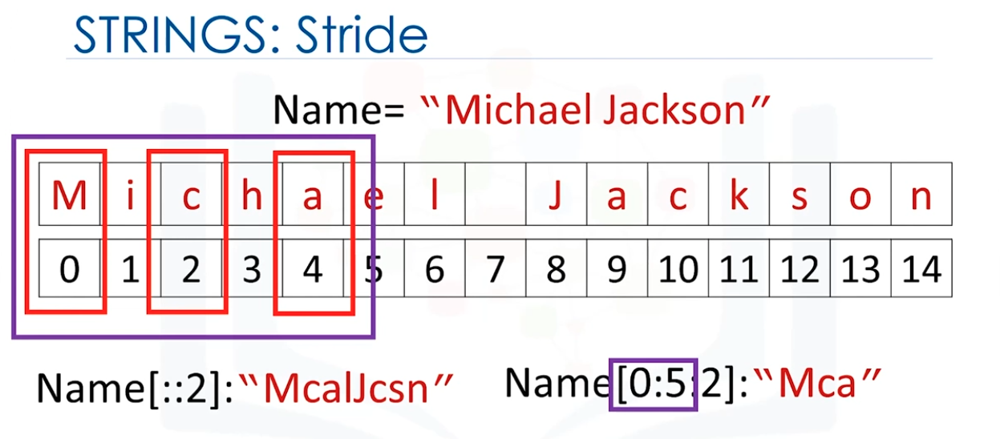

# Types

* **int**: integers like 11

* **float**: real numbers like 23.87

* **str**: strings like "Hello, world!"

* **Boolean (bool)**: True or False

We can see the actual data type of a variable in Python using the following command:

```
type(variable)
```

We can convert some variable types into others, perfoming **type casting**

```
float(2) = 2.0
int(1.9) = 1
int('1') = 1
int('a') -> error

str(1) = "1"
str(4.5) = "4.5"
```

# Expressions

Expressions describe a type of operation that computers perform

For example, basic arithmetic operations like adding multiple numbers

```
50 + 45 + 98 = 193

5 * 5 = 25
```

The numbers are **operands** and the math symbols are **operators**

* **Addition**: 5 + 2

* **Subtraction**: 5 - 2

* **Multiplication**: 5 * 2

* **Division**:
    * Using */*: 25 / 6 = 4.167 (float division)
    * Using *//*: 25 // 6 = 4 (integer division - the result is rounded)

Python expressions perform mathematical conventions

The expressions inside parentheses are performed first

Variables store values

```
variable = 1.2
```


# String Operations

**String** is a sequence of characters

```
"a string 12 ()"
'a string 12 ()'
```

Each element in the sequence can be accessed using an index represented by the array of numbers



We can use negative indexes. It starts with index -1 (so it's like one-based indexing)




We can perform **string slicing**



We can perform **string stride**, that is, skipping some characters



We can get the length of the string using **len** command

```
len(string_variable)
```

We can **concatenate** strings:

```
Name = "Michael Jackson"
Statement = Name + " is the best"
Statement = "Michael Jackson is the best"
```

We can replicate values of a string

```
3 * "oi " = "oi oi oi " 
```

* **\n**: new line

* **\t**: tab

## String Methods

### string.upper()

```
A = "oi"
B = A.upper() # B = "OI"
```

### string.replace()

```
A = "hello, world"
B = A.replace("hello", "hi") # B = "hi, world"
```

### string.find()

```
Name = "Michael Jackson"
Name.find('el'): 5 # index 5
Name.find('Jack'): 8 # index 8
Name.find('&*D'): -1 # not found
```

### f-strings

```
name = "John"
age = 30
print(f"My name is {name} and I am {age} years old.")
```

It prints: **My name is John and I am 30 years old.**

### str.format()

```
name = "John"
age = 50
print("My name is {} and I am {} years old.".format(name, age))
```

It prints: **My name is John and I am 30 years old.**

### % Operator

```
name = "John"
age = 50
print("My name is %s and I am %d years old." % (name, age))
```

It prints: **My name is John and I am 30 years old.**


### Additional Capabilities

```
x = 10
y = 20
print(f"The sum of x and y is {x+y}.")
```

It prints: **The sum of x and y is 30.**


### Raw string (r'')

Raw strings are a powerful tool for handling textual data, especially when dealing with escape characters

By prefixing a string literal 'r', Python treats the string as raw, meaning it interprets backslashes as literal characters rather than escape sequences

**Regular string**

```
regular_string = "C:\new_folder\file.txt"
print("Regular String:", regular_string)
```

It prints:

Regular String:  C:
ew_folderile.txt

**Raw string**

```
raw_string = r"C:\new_folder\file.txt"
print("Raw String:", raw_string)
```

It prints:

Raw String: C:\new_folder\file.txt