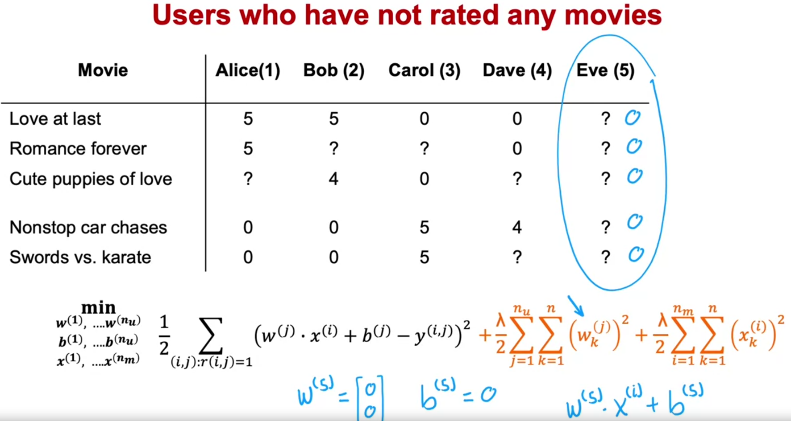
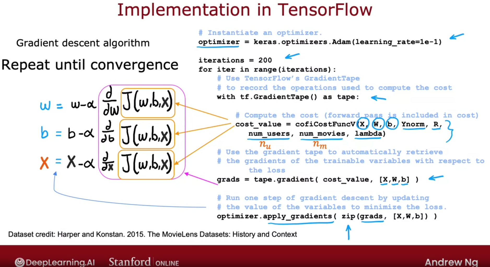
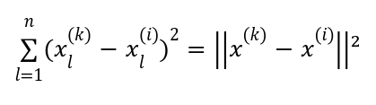
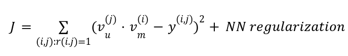
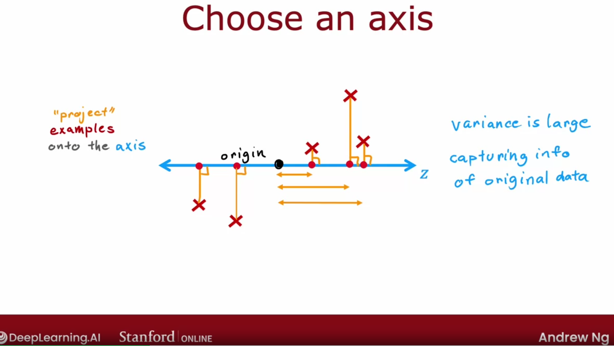
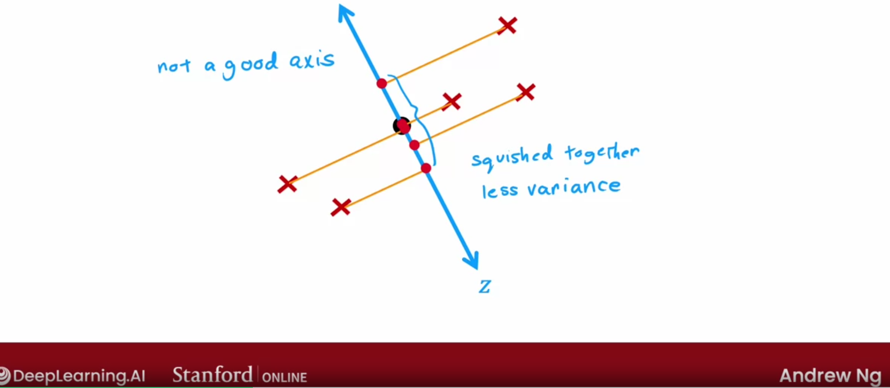
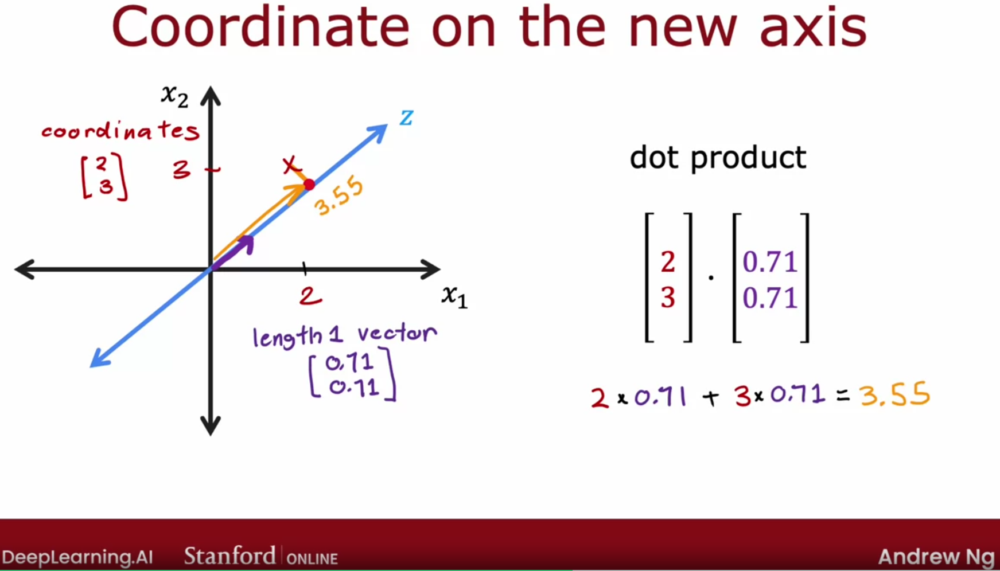
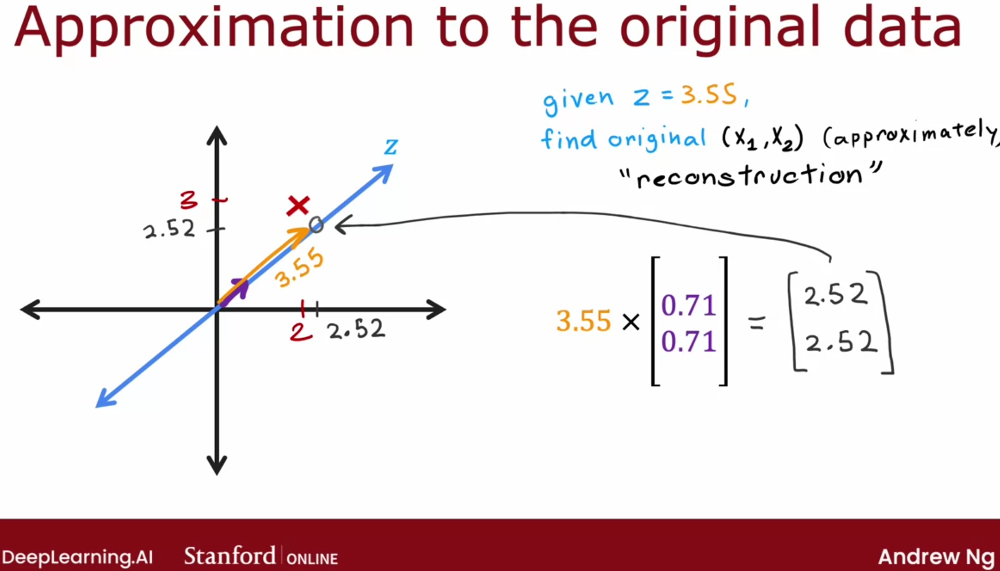

# Recommender Systems

## Collaborative Filtering

**Making recommendations** is one of the topics that has received quite a bit of attention in academia, but the commercial impact and the actual number of practical use cases of recommended systems seems to be vastly greater than the amount of attention it has received in academia

Many sites will recommend things to you that they think you may want to buy or movies that you want to watch. The value that comes through these recommendations is very large

In the typical recommended system, you have some number of users and some number of items.

For example, in a movie website, the users can rate the movies using zero to five stars. In this case, the movies are the items

* **n<sub>u</sub>**: the number of users

* **n<sub>m</sub>**: the number of movies

* **r(i, j) = 1** if user *j* has rated movie *i*

* **y<sup>(i, j)</sup>** = rating given by user *j* to movie *i* (defined only if r(i, j) = 1)

With this framework for recommended systems, one possible way to approach the problem is to look at the movies that the users have not rated, then try to predict how users would rate movies. Doing so, we can try to recommend to users things that they are more likely to rate as five stars

### Using per-item Features

Firstly, let's assume that we have some extra information about the items (in this case movies), such as: the genre

For this, each movie has two features for example:

* **x<sub>1</sub>**: how much of the movie is a romance movie

* **x<sub>2</sub>**: how much of the movie is an action movie

They're like membership functions (of fuzzy systems)

* **n**: the number of features of each movies

* **x<sup>(1)</sup>** = [ feature1 of movie1, feature2 of movie1]

For user 1, we could predict the rating for movie i as: 

w<sup>j</sup> x<sup>i</sup> + b<sup>j</sup> (just like linear regression)


So, there is a different linear regression model for each user

* **m<sup>(j)</sup>**: the number of movies rated by user *j*

The cost function for learning the parameters w<sup>j</sup> and b<sup>j</sup> for user j is the following:


We must minimize the cost function

It turns out that for recommender systems it would be convenient to actually eliminate the division by m<sup>j</sup> term


But how can we learn the parameters w, b for all users?

We have to minimize the following cost function:


If you use gradient descent algorithm or any other optimization algorithm, you'll have a pretty good set of parameters for predicting movie ratings for all the users

## Collaborative Filtering Algorithm

What if we don't have the features x<sub>i</sup>?

Firstly, let's assume that we have the parameters *w* and *b* for all users. Having them, how can we get reasonable features for each movie?

We could obtain those features *x* using linear systems


As well, to get the values *x*, we can use a cost function and try to minimize it:


But we could only come up with this equation, because we knew the features *w* and *b*. If we didn't know the parameters *w* and *b* and the features *x*, we could use the following approach:


To minimize this cost function, we could:

* use Gradient Descent


**Collaborative Filtering** is gathering the data from multiple users to help you predict ratings

### Binary Labels

Many important applications of recommeder systems involve **Binary Label** where instead of a user giving you zero to five stars, they give you a SENSE of if they like the item of not

In the following example, 1 could mean that the user hit like or favorite button on that particular movie or that it watched the movie until the end


For Binary Labels, we are going to predict that the probability of **y<sup>(i, j)</sup>** = 1. This is given by **g(w<sup>j</sup>x<sup>i</sup> + b<sup>j</sup>)**, where g(z) is the **sigmoid function**

The cost function for Binary Application is:


# Recommender Systems Implementation Detail

## Mean Normalization

Normalization can help the algorithm to run faster

In the next example, a new user was added. It has not rated any movie yet. If you were to train a collaborative filtering algorithm on the data, since we are trying to make the parameter *w* small (because of the regularization term), and run the algorithm, the parameters *w* and *b* for the new user (Eve) will be 0

Moreover, as long as the new user hasn't rated any movie yet and the regularization term tries to minimize *w*, *w* will be 0 for the new user. This will mean that the new user has rated every movie as 0 and it will not be very helpful



Mean Normalization will help the algorithm comes up with better prediction of the movie ratings for a new user that hasn't rated any movies

Firstly, well turn the dataset into a 2d-matrix. For each row (movie), we'll compute the average rating that was given to it

We'll store the average ratings into a μ vector. Then, for each movie, we're going to subtract each rating that was given to it by its average rating and this will be our new **y** matrix

Doing so, we predict: **w<sup>j</sup>x<sup>i</sup> + b<sup>b</sup> + u<sub>i</sub>**

Now, the *w* and *b* parameters for the new user won't be 0, but the average rating of each movie and this will be more reasonable than giving 0

It turns out that by normalizing the mean of the different movie ratings to be zero, the optimization algorithm for the recommender system will also run just a little bit faster but it does make the algorithm behave much better for users who have rated no movies or just a small numbers of it

You could also normalize by the columns. It depends on the application which one is more reasonable. In this example, it would mean predicting the rating of a movie that hasn't been rated by any user


## TensorFlow Implementation

TensorFlow is not only a tool for neural network, but for other learning algorithms as well

One of many great things TensorFlow does is calculate optimally the derivatives needed for gradient descent

**Auto Diff**

```
w = tf.Variable(3.0) # initializing the parameter w
x = 1.0
y = 1.0 # target value
alpha = 0.01 # learning rate

iterations = 30

# Automatically computes the derivatives
for iter in range(iterations):
    # Use TensorFlow's Gradient tape to record the steps
    # used to compute the cost J, to enable auto differentiation
    with tf.GradientTape() as tape:
        fwb = w*x # f(x)
        costJ = (fwb - y)**2

    # Use the gradient tape to calculate the gradients
    # of the cost with respect to the parameter w
    [dJdw] = tape.gradient( costJ, [w] )

    # Run one step of gradient descent by updating
    # the value of w to reduce the cost
    w.assign_add(-alpha * dJdw)
```

The implementations of our recommender system example will be the following:

```
# Instantiate an optimizer
optimizer = keras.optimizers.Adam(learning_rate=1e-1)

iterations = 200
for iter in range(iterations):
    with tf.GradientTape() as tape:
        # Compute the cost (forward pass is included in cost)
        # Figure out automatically the derivatives
        # Record the sequence of operations used to compute the cost
        cost_value = cofiCostFuncV(X, W, b, Ynorm, R,
            num_users, num_movies, lambda)

    # Use the gradient tape to automatically retrieve
    # the gradients of the trainable variable with respect to
    # the loss
    # Compute the derivative
    grads = tape.gradient( cost_value, [X, W, b] )

    # Run one step of gradient descent by updating
    # the value of the variables to minimize the loss
    optimizer.apply_gradients( zip(grads, [X, W, b]) )
```



# Finding Related Items

In practice, the features x<sup>i</sup> of item i are quite hard to interpret

Collectively, the features x<sup>1</sup>, x<sup>2</sup>, x<sup>3</sup>, ..., x<sup>n</sup> do convey something about what that movie is like

If you want to find other items related to item i, you have to find **item k** with x<sup>**(k)**</sup> (a vector) similar to x<sup>(i)</sup>

**How can we determine if x<sup>(k)</sup> is similar to x<sup>(i)</sup>?**



Then, you could return the 'z' most related items to the user 

## Limitations of Collaborative Filtering

### Cold Start Problem

* How to rank new items that few users have rated?

* How to show something reasonable to new users who have rated few items?

### Use Side Information about Items or Users

It doesn't give us a natural way to use side information or additional information about items or users

* **Items**: Genre, movie stars, studio, ...

* **User**: Demographics (age, gender, location), expressed preferences, ...


# Content-based Filtering Algorithm

* **Collaborative Filtering**: recommend items to you based on ratings of users who gave similar ratings as you

* **Content-based Filtering**: recommend items to you based on features of user and item to find good match. It requires having some features of each user as well as some features of each items and it uses those features to try to try to decide which items and users might be a good match for each other

### Examples of user and item features

* **X<sub>u</sub><sup>(j)</sup>**: user features such as: age, gender, country, movies watched, average rating per genre

* **X<sub>m</sub><sup>(i)</sup>**: movie features such as: year, genre/genres, reviews, average ratings

Now, we're going to predict the rating of user j on movie i as:

**V<sub>u</sub><sup>(j)</sup> V<sub>m</sub><sup>(i)</sup>**

* **V<sub>u</sub><sup>(j)</sup>**: list of numbers computed from the features of user j

* **V<sub>m</sup><sup>(i)</sup>**: list of numbers computed from the features of movie i

If we're able to come up with good choice of those vectors, then hopefully the dot product of them will be a good prediction of the rating that a user j gives to a movie i

For example, the values of V<sub>u</sub><sup>(j)</sup> could represent the users preferences, how much user j likes romance movies, how much user j likes action movies...

The same could be said for V<sub>m</sup><sup>(i)</sup>. Its values could represent the movies features, such as: how much movie i is a romance movie...

X<sub>u</sub><sup>(j)</sup> can have different size than X<sub>m</sub><sup>(i)</sup>

V<sub>u</sub><sup>(j)</sup> must have the same size as V<sub>m</sub><sup>(i)</sup>, since we're going to do a dot product of them

## Deep Learning for Content-based Filtering

A good way to implement Content-based Filtering is to use **Deep Learning**

To compute the V<sub>u</sub> and V<sub>m</sub> vectors, we are going to use neural network

The first neural network will be called **user network**

In this neural network, the input will be the vector X<sub>u</sub>. Then, there are some few Dense layers (128 units, 64 units, 32 units). In this example, the output layer V<sub>u</sub> will have 32 units

The second neural network will be called **movie network**

In this neural network, the input will be the vector X<sub>m</sub>. Then, ther e are some few Dense layers (256 units, 128 units, 32 units). In this example, the output layer V<sub>m</sub> will have 32 units 

As mentioned, the output layer of both, user and movie network, must have the same size

Finally, we are going to predict the rating of user j in movie i as: prediction = **V<sub>u</sub><sup>(j)</sup> V<sub>m</sub><sup>(i)</sup>**

V<sub>u</sub><sup>(j)</sup> and V<sub>m</sub><sup>(i)</sup> can have different number of layers and different number of units per hidden layers

If you want to know if the user j would like the movie i, you could use the sigmoid function to predict the probability that Y<sup>(i, j)</sup> is 1: g(v<sub>u</sub><sup>(j)</sup> . v<sub>m</sub><sup>(i)</sup>)

This model has a lot of parameters. Each layer of the neural network has a set of parameters of the neural network. So, **how do you train all the parameters of both the user network and the movie network?**

We use a cost function J shown below:



Depending on the parameters of the neural network, you may end up with different vectors for the users and for the movies. So, we train the modal so that we end up with vectors that result in small squared error

After you've trained this model, you can use it to find similar items

In our example:

* v<sub>u</sub><sup>(j)</sup> is a vector of length 32 that describes user j with features x<sub>u</sub><sup>(j)</sup>

* v<sub>m</sub><sup>(i)</sup> is a vector of length 32 that describes movie i with features x<sub>m</sub><sup>(i)</sup>

**To find movies similar to movie i:**

You can look for movies k that the distance between their vectors v<sub>m</sub><sup>(k)</sup> and the movie i is small

||v<sub>m</sub><sup>(k)</sup> - v<sub>m</sub><sup>(i)</sup>||² small

This can be pre-computed, that is, for example, you can run a compute server overnight to go through the list of movies and, for every movie, find similar movies to it, so that, in the morning, your user will see the most similar movies to the movie that user's watching

**It can be computationally very exzpensive to run if you have a large catalogue...**

## Recommending from a large catalogue

Some applications may have thousands, millions of items. How can we make our recommendation system more efficient?

Having to run neural network inference thousands of millions of times every time a user shows up on your website becomes infeasible

Many large scale recommender systems are implemented in two steps:

* **Retrival**: during the retrieval step, we will generate a large list of plausible items candidates. This tries to cover a lot of possible things you might recommend to the user. You may add some items that the user is not likely to like
    
    * For each of the last 10 movies watched by the user, we may get the 10 most similar movies

    * For most viewed 3 genres, find the top 10 movies

    * Top 20 movies in the country

    * Then, we combine the retrieved items into a list, removing duplicates and items already watched/purchased

* **Ranking**: during the ranking step, we will fine and tune to pick the best items to recommend to the user. In other words, we take the retrieved list and rank using the learned model

One question you may ask is: how many items do I retrieve in the retrieval step?

Retrieving more items results in better performance, but slower recommendations

To analyze/optimize the trade-off, cary out offline experiments to see if retrieving additional items results in more relevant recommendations

## Ethical Use of Recommender Systems

What could be the goal of the recommender system?

* Movies most likely to be rated 5 stars by user

* Products most likely to be purchased

* Ads most likely to be clicked on (+ high bid ads)

* Products generating the largest profit

* Video leading to maximum watch time

Sometimes, it could be nice if the website was transparent with you about the criteria by which it is deciding what to show you. Is it trying to be more profitable or is it trying to show you things that are most useful to you?

The three last items may be problematic goals

## TensorFlow Implementation

```
user_NN = tf.keras.models.Sequential([
    tf.keras.layers.Dense(256, activation='relu'),
    tf.keras.layers.Dense(128, activation='relu'),
    tf.keras.layers.Dense(32)
])

item_NN = tf.keras.models.Sequential([
    tf.keras.layers.Dense(256, activation='relu'),
    tf.keras.layers.Dense(128, activation='relu'),
    tf.keras.layers.Dense(32)
])

# create the user input and point to the base network
input_user = tf.keras.layers.Input(shape=(num_user_features))
vu = user_NN(input_user)
vu = tf.linalg.l2_normalize(vu, axis=1)

# create the item input and point to the base network
input_item = tf.keras.layers.Input(shape=(num_items_features))
vm = item_NN(input_item)
vm = tf.linalg.l2_normalize(vm, axis=1)

# measure the similarity of the two vector outputs
output = tf.keras.layers.Dot(axes=1)([vu, vm])

# specify the inputs and output of the model
model = Model([input_user, input_])

# specify the cost function
cost_fn = tf.keras.losses.MeanSquaredError()
```

# Principal Component Analysis

Principal Component Analysis (PCA) is an algorithm that is commonly used for **visualization**, specifically for a dataset that you have a lot of features. You can't plot a 1000 dimensional data for instance

It's an algorithm that allows you to take data with a lot of features and reduce the number of features to 2 features or maybe 3 features, so that you can plot it and visualize it

It's a technique commonly used by data scientists

Let's have as an example data from a collection of passenger cars. Passengers cars may have a lot of features

Let's say we are given two features of each car: the length and the width

Generally, the width of the cars doesn't change much. For example, in the U.S, the common car width is 6 feet and it doesn't vary that much. So, we can only take the length feature to reduce the number of features. Only one feature has a meaningful degree of variation

Now, let's say that we have two features: the length and the height of the car. Both vary a lot, so we can't take only one of them. Instead of being limited to taking either the length (x1 axis) or the height (x2 axis), let's have a third one (z axis for example), that is a combination of x1 and x2. The z axis could represent something like "the size" of the car as long as it is a combination of length and the height of the car

So, **PCA** finds one or more new axes, so that when you measure your data's coordinates on the new axis, you end up still with really useful information, but maybe, instead of two numbers corresponding to the coordinates on x1 and x2, you now need a few numbers to capture roughly the size of the car

When it reduces the number of features, the trick thing is that you have now to figure out a way to interpret those features, since it can reduce thousands of features to 1, 2 or 3

How can we replace, for instance, 2 features with just one? How can we choose a new axis, that is, somehow, a good feature for capturing or representing the data?

Before anything else, you must preprocess the features, that is, **normalize** them so that they have zero mean and do a **feature scaling** as well

Then, we could "create" an axis and project the example onto the axis



The points are quite spread apart and so the variation among those five points on z-axis is decently large, so we are capturing info of the original data

Choosing another z-axis, the projection of the points may be squished together, that is, their variance is much less than the original one, so you're capturing much less of the information of the original data



So, we want to get an axis so that we have the maximum possible variance so we capture more info. This axis is called **principal component**

What is going to be the coordinate on the new axis?



If you were to pick a second principal component, it's 90° to the first axis

If you were to pick a third principal component, it'd be at 90° to the first and to the second axis

**PCA is not linear regression**

You are not trying to fit a line to use x1 to predict x2. PCA finds axis to retain variance (info)

PCA is trying to take a lot of features and treat them equally and reduce the number of axis needed to represent the data well

It turns out that maximizing the spread of these projections will correspond to minimizing the distances of the line segments (the distance that the points have to move in order to be on the new axis)

### PCA Reconstruction

**Can we do the opposite? Given the value on the new axis, can we get an approximation to the original data?**

This step is called **Reconstruction**

We don't have much information to get back to the original values (axis) exactly, but we can approximate

