# Reinforcement Learning Introduction

Let's start with an example. Let's say we have an autonomous helicopter and we want to make it fly by itself.

We can't use supervised learning since there is a lot of states (like the position, velocity, distance to objects) and actions to take (the ideal y)

* **Reward function**: a function that tells the helicopter how when it's doing well and when it's doing poorly

It's like training a dog. When it does something good, you say "good dog". Otherwise, you say "bad dog". Hopefully, it learns to do more of the good dog things and fewer of the bad dog things

It's a powerful algorithm since you have to tell it what to do rather than how to do it and specifying the reward function rather than the optimal action gives you a lot more flexibility in how you design the system

There are positive rewards and negative ones. When the helicopter flies well, you give it +1 "points"

When it flies poorly, you remove 1000 "points"

### Applications

* **Controlling robots**

* **Factory Optimization**

* **Financial (stock) trading**

* **Playing games**

Let's have as an example a simplified Mars Rover

Let's say the state 1 is more valuable for the scientists than the state 6, because they want the robot to sample more from that surface. The scientists are not interest in the other states. So, for instance, the state 1 has a reward of 100, state 6 has a reward of 40 and all the other ones have a reward of 0. But, since we started at state 4, the state 6 is closer to the robot

In each position, the robot can go to the left or to the right

Futhermore, we are going to call states 1 and 6 **terminal states**, that is, after the robot gets to one of these terminals, nothing more happens

The robot could go to the left, then to the right, then to the left and, after some time, decides to go to a terminal state and get its reward. He would do it because it doesn't change its points doing unnecessary moves since the reward of states 2, ..., 5 is 0

* **S**: the current state of the robot

* **a**: an action that the robot can take

* **R(s)**: a reward that the robot will take going to state S

* **S'**: new state the robot will be if it takes action a at state S

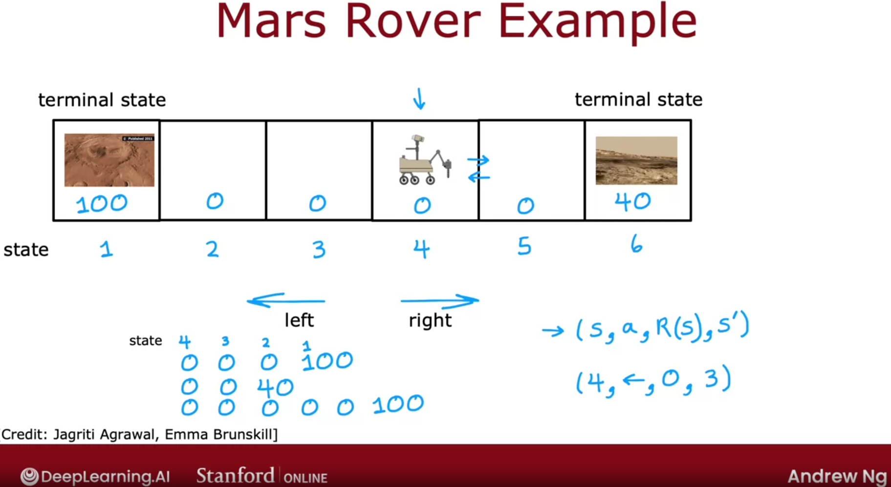

## Return

The concept of a return captures that rewards that you can get quicker are maybe more attractive than rewards that take you a long time to get to

* **Discount Factor γ**: it's a number a little bit less than 1 that the algorithm will weight each reward that you take powered by the how many actions you took so far. It makes the algorithm a little bit more impacient. So, getting rewards sooner results in a higher value for the total sum

    * Usually, it's 0.9, 0.99, 0.999

    * In financial case, the discount factor could be interpret as the "interest rate"

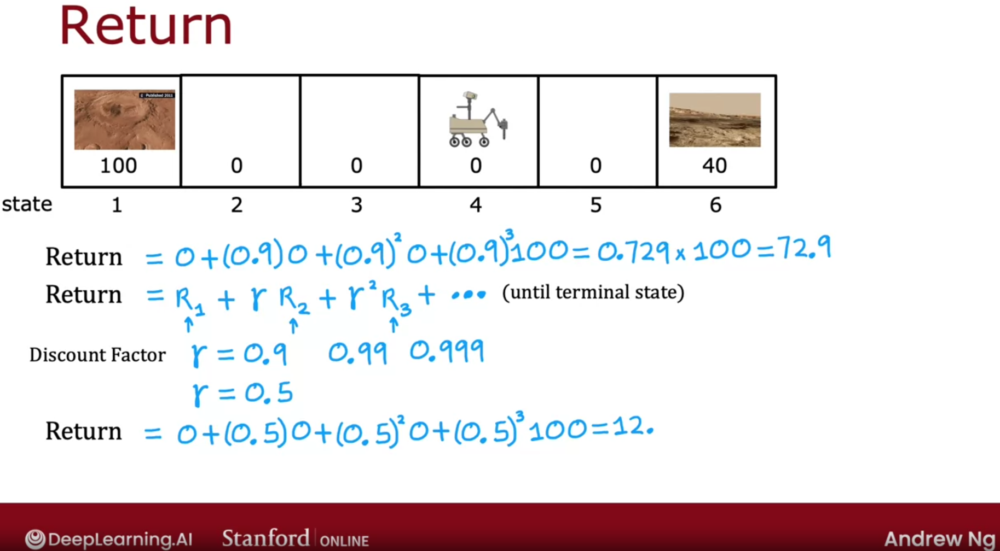

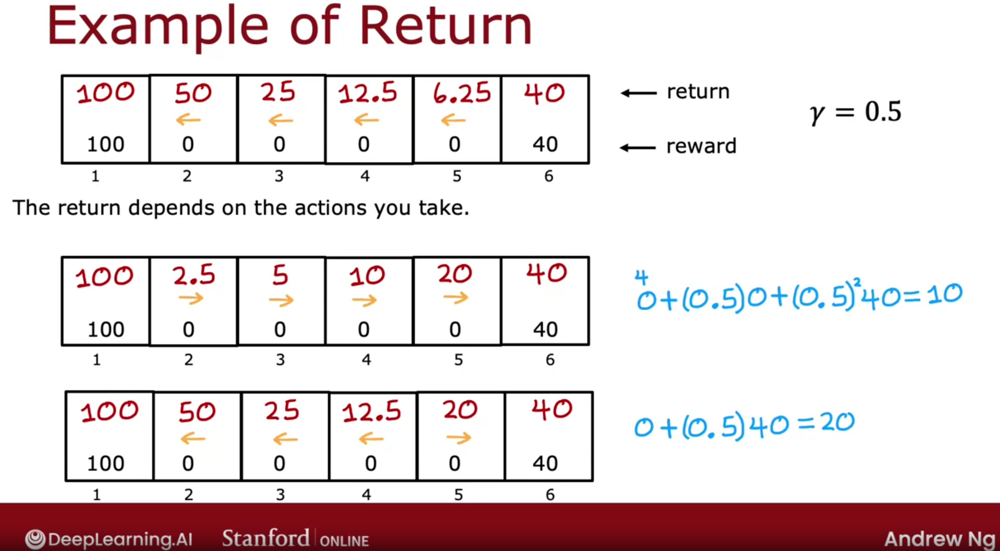

In the fist case above, we always go to the left. Starting at the state, we would get a return of 50

In the second case, we always go to the right

In the third case, what action we should take depends on the state that we start at. If we start at state 2, 3 or 4, we go to the left. If we start at state at 5, we go to the right

A state reward could be negative. So, the discount factor incentivizes the system to push out the negative rewards as far into the future as possible

Our **goal** is to come up with a function, which is called a **policy π**, whose job it is to take as input any state s and map it to some action a that it wants us to take

Find a policy π that tells you what action (a = π(s)) to take in every state s so as to maximize the return

### Examples

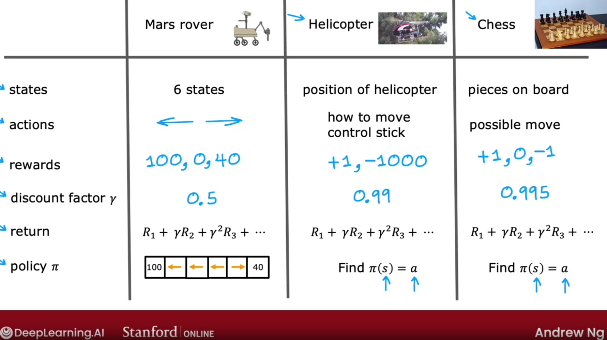

The formalism above is called **Markov Decision Process (MDP)**

In Markov Decision Process, the future depends only where you are now not on how you got at the current state

The robot is our example could be called **agent**. If it takes an action a, something will happen in the **environment**

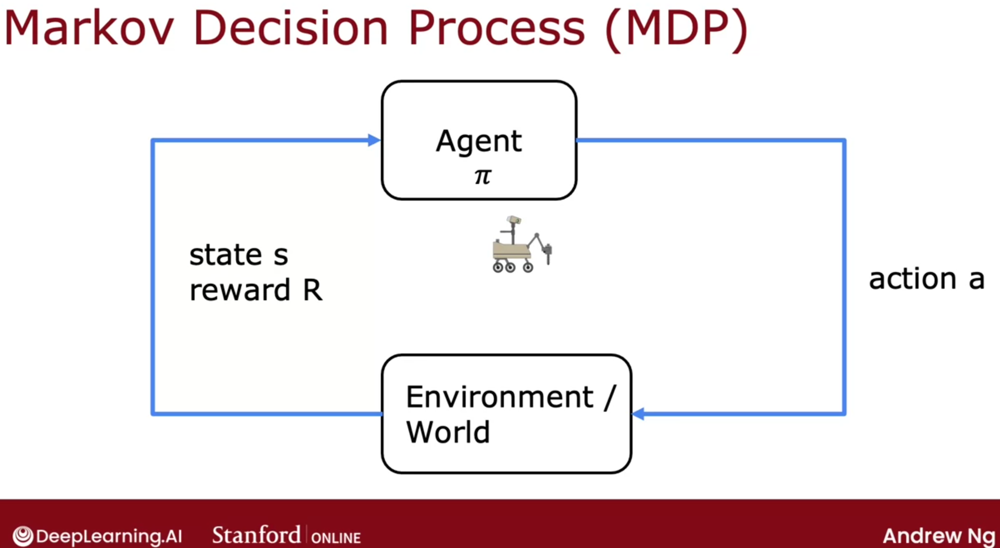

### State Action Value Function

The **State Action Value Function** or **Q function** (Q* or Optimal Q function) is typically denoted by the letter Q. It's a function of a state *s* you might be in as well as the action *a* you might take. The function *Q(s, a)* will give a return value if you start at state *s*, take the action *a* once, then behave optimally after that

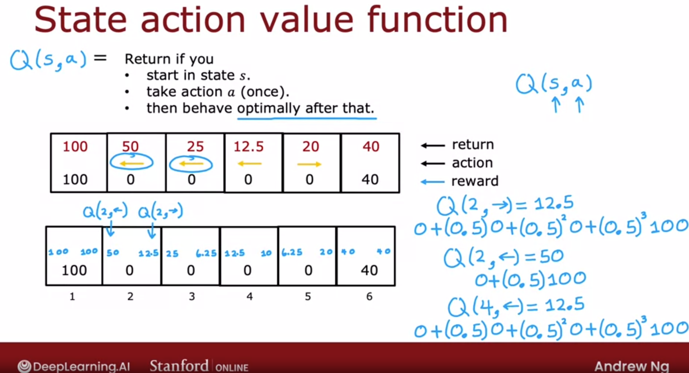

Computing Q(s, a) for every state s and action a will make evident which action *a* is the best to take at state *s*, that is, the best return value from state *s* is the largest Q(s, a) and the best possible action to take at state s is the one that gives you the maximum Q(s, a). So, if can compute the Q(s, a) for every state and every action, you can compute the optimal policy π(s)

## Bellman Equation

The Bellman Equations helps you to compute the state cost value function

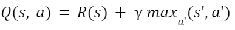

* γ is the discount factor

* R(s) is the reward function

If you are at a terminal state, the equation is:

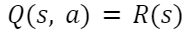

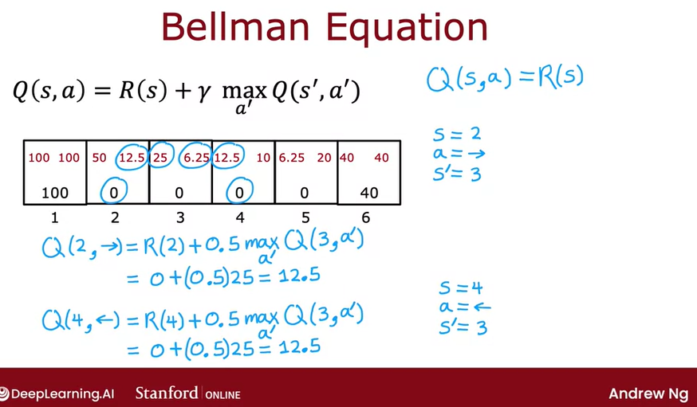

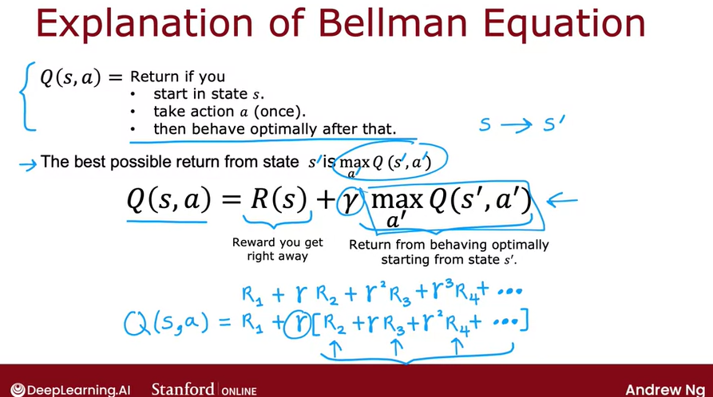

## Random (stochastic) Environment

In some cases, the outcome is not completely reliable. For example, if you command your mars rover to go left, maybe there's a little bit of rock slide, so it goes to the wrong direction

Then, there is a generalization of reinforcement learning framework, which models random or stochastic environments

Using the above example (rock slide), let's say that if the robot is at state 4 and we want it to go to the left. It has 90% chance of going in the right way and 10% of going to the right. If we want it to go to the right side, it has the opposite probability

So, maybe the actual sequence of states the robot visit may be random. If the Reinforcement Learning Problem is stochastic, there is NOT only one possible sequence of states

Futhermore, in stochastic environment, we are not interested in is not maximizing the return, since it is a random number, but we are interested in is maximizing the average value of the sum of the discounted rewards, that is, take the average of all the *thousands* different possible sequences (**expected return**)  

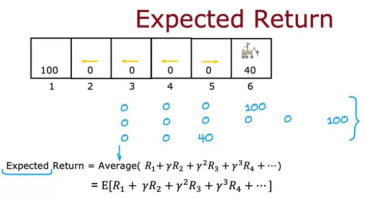

So, we want to choose a policy π(s) = a that will tell us what action a to take in state s so as to maximize the expected return

It changes the Bellman Equation since, if you are at state 3, the next state s' you will be at if you take action a will be random

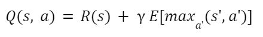

The probability of the robot not going in the *right* direction could represent the *lack of the robot's control* in percentage

# Continuous State Spaces

Most of the applications have continuous state spaces, in opposite to the Mars rover robot example

Most of the robots can be in more than any discrete number of states

For instance, to build a self drive car, each state may have its *x* position, its *y* position, its orientation *θ*, its speed on *x*-direction (x'), its speed on *y*-direction (y') and how fast it is turning (θ'). Any of those variables can take any value within its valid range

## Lunar Lander Example

The Lunar Lander lets you land a simulated vehicle on the moon. It is rapidly approahing the surface of the moon and the learning algorithm's job is the fire thrusters at the appropriate times to land it safely on the landing pad

### Actions

In this examples, there are 4 possible actions:

* do nothing
* main thruster
* right thruster (push the lander to the left)
* left thruster (push the lander to the right)

### States

The states are going to be:

* **x**: x position
* **y**: y position
* **x'**: x-direction velocity
* **y'**: y-direction velocity
* **θ**: its orientation
* **θ'**: orientation velocity
* **l**: has it landed the left leg?
* **r**: has it landed the right leg?

### Reward Function

* Getting to landing pad: 100 - 140, depending on how well it lands on the center of the pad

* Additional reward for moving toward/away from pad

* Crash: -100

* Soft landing: +100

* Leg grounded: +10

To not waste too much fuel

* Fire main engine: -0.3

* Fire side thruster: -0.03

Since we are not so *impacient* of landing the lander, the discount factor will be γ = 0.985

### Deep Reinforcement Learning

We are going to train a neural network to compute or approximate the state action value function Q(s, a) and that, in turn, will let us pick good actions

The inputs of the neural network will be the column matrix [s a]. The actions can be transformed in a one-hot feature process

The output will be Q(s, a) = y (target value)

So, in a state *s*, we're going to compute Q(s, nothing); Q(s, left); Q(s, main); Q(s, right) and, then pick the action a that maximizes Q(s, a)

**How can we use a neural network to output Q(s, a)?**

We're going to use Bellman's equation to create a trainig set with lots of examples *x* and *y* and then, we'll use supervised learning

We are going to use the lunar lander and try to take different actions in it. If we don't have good policy yet, we are going to take actions randomly

In each *test*, we'll have a tuple that has the state *s*, the action *a*, the reward value of *s* and the *goal state s'* and it will be a training example. We can take random guesses on the Q function

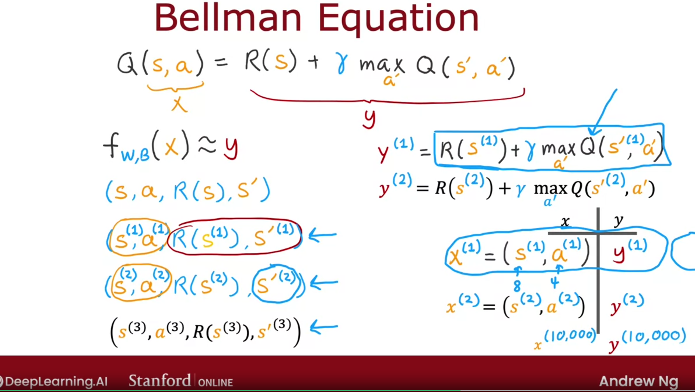

The steps are:

* Initialize Neural Network randomly as guess of Q(s, a)

* Repeat:
    * Take actions in the lunar lander. Get (s, a, R(s), s')

    * **Replay Buffer**: store 10000 most recent (s, a, R(s), s')

* Train the neural network
    * Create training set of 10000 examples x= (s, a) and y = R(s) + γ max a' in (Q(s', a'))

    * Train Qnew (neural network model) such that Qnew(s, a) = y (approximately)

* Set Q = Qnew

## Algorithm Refinement

There is a change to the neural network architecture that makes this algorithm much efficient

Since in a state *s*, there is 4 possible actions, we'd have to carry out inference in the neural network separately 4 times to compute those 4 values so as to pick the action *a* that gives us the largest Q value. This is inneficient, as long as we have to carry out our inference four times from every single state

It turns out that is way more efficient to train a single neural network to output all four of these values simultaneously

Now, the input layer will have only the state *s* and the output layer will have 4 units (one for each state), Q(s, nothing), Q(s, left), Q(s, main), Q(s, right). Then, the neural network will compute simultaneously the Q value for all possible actions, so we run the inference only once and get all possible Q values

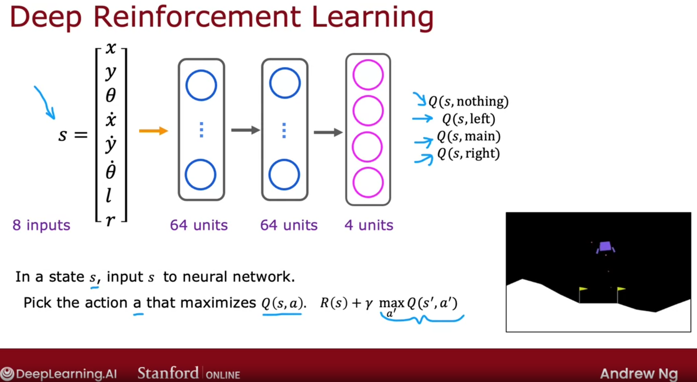

### ε-greedy Policy

In order to approximate Q(s, a), we must take some actions. How do we pick those actions? The most common way to do so it to use ε-greedy policy

In some state *s*:

* Option 1
    * Pick the action *a* that maximizes the guessed Q(s, a)

* Option 2 (ε-greedy policy; ε = 0.05)
    * With probability 0.95, pick the action *a* that maximizes Q(s, a) (greedy action or exploitation step)

    * **Exploration Step**: with probability 0.05, pick an action *a* randomly (not always try the best choice)

Why would we want to pick an action *a* randomly?

Let's say that there is some strange reason that Q(s, a) was initialized randomly so that the learning algorithm thinks that firing the main thruster is never a good idea, that is, Q(s, main) is always very slow

Therefore, the neural network, since it's trying to pick the action *a* that maximizes Q(s, a), will never ever thruster the main thruster and it will never learn that sometimes fire the main thruster is a good idea

A common practice is to:

* Start ε high

* Gradually decrease it

The choice of ε is way importante since, depending on your choice, the algorithm can take 100 times more to learn for example (way worse than choosing a low learning rate)

### Mini-Batch and Soft Update

Mini-batch can speed up your reinforcement learning algorithm and it's also applicable to supervised learning

Soft Update helps your reinforcement learning to do a better job to converge to a good solution

Imagine that your dataset has over 100 million samples. On each gradient descent step, it computes the cost function over 100 million examples. So, it would be very slow

The idea behing **mini-batch** is not use all 100 million training examples on every single iteration. Instead we may pick a smaller number, let's say 1000. Then, on each step, we would pick some subset of 1000 examples, so it requires much less time. Moreover, on each step, the subset may be different

In Batch Learning, each iteration of gradient descent makes the optimal move to get to lowest cost function value. In contrary, in mini-batch learning, this doesn't happen on each step. It may do some bad choices and get away of the optimal solution. But, on average, it tends toward the global minimum (not reliably and sometime noisily), although it's very computacionally cheaper

In Unsupervised Learning case, you stored 10000 most recent tuples. Using mini-batch, out of these 10000 tuples, you choose 1000 to train your model

Now, let's talk about **soft update**. Remember that, on each step of deep reinforcement learning, we were setting Q equals to Qnew, but what if Q function was better than Qnew? You would've overwritten your better Q function with a worse one

To avoid this situation, instead of setting Q = Qnew, we set Q = 0.01Qnew + 0.99Q for example

Therefore, whenever we train a new neural network model, we are only going to accept a little bit of the new value

It makes the reinforcement learning algorithm to converge more reliably (it will less probably oscillate or divert or have other undesireble properties)

## Limitations of Reinforcement Learning

* Much easier to get to work in a simulation than a real robot

* Far fewer applications than supervised and unsupervised learning